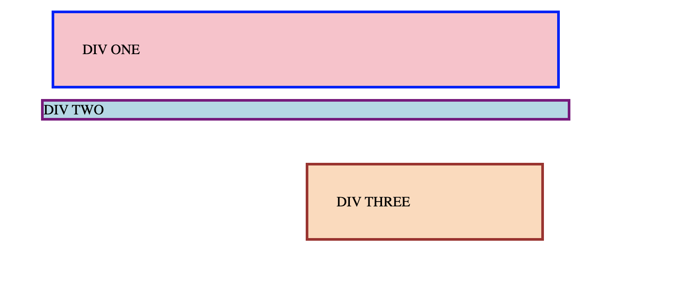

# Project Title
Exercises on css box model

## Description
These are assignments based on the odin project which is a curriculum to teach web development.
In these projects, we focus on using box model properties to adjust and align content on web pages

## Self check
- Use this section to check your work. On these projects, your goal isn't to attain 100% pixel perfection, but to use the tools you've learned to get relatively close to the desired output.

- Div One and Div Three have 32px between their text and border.
- Div One has 12px between it and any other element on the page.
- There is a 48px gap between Div Two and Div Three.
- Div Three is aligned to the right.
- Div Three's alignment is achieved using margin (and not float, flexbox, etc.).

## My output

## Author

@nd31pr0

## credits

theodinproject.com

